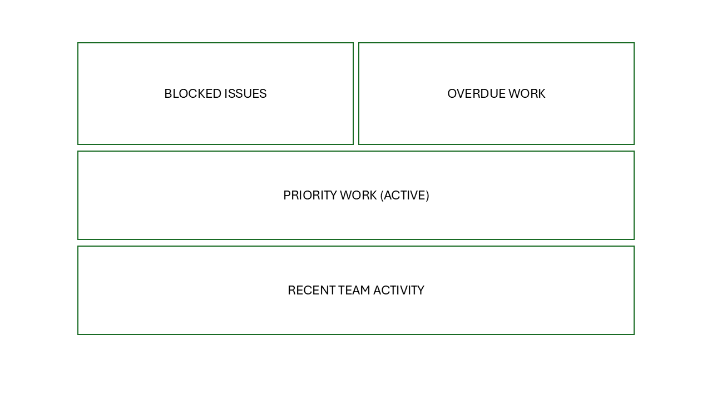

# Jira Dashboard Design (Delivery & Risk Focus)

## Overview

This project demonstrates the design of a Jira dashboard aimed at providing clear visibility of delivery, risks, and team progress.

The dashboard is designed for different stakeholders, including managers and team leads, and focuses on actionable insights rather than raw data.

---

## Objectives

- Highlight critical issues (blocked work)
- Identify delays (overdue items)
- Show priority work
- Provide visibility into team activity and progress

---

## Dashboard Structure

┌─────────────────────┬─────────────────────┐
│   Blocked Issues    │    Overdue Work     │
├─────────────────────┴─────────────────────┤
│        Priority Work (Active)             │
├───────────────────────────────────────────┤
│        Recent Team Activity               │
└───────────────────────────────────────────┘

## Visual Example

