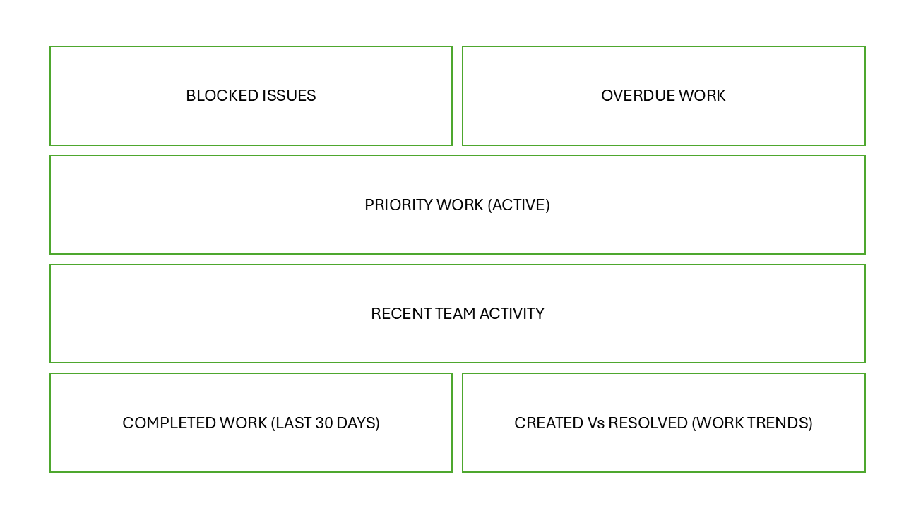

# Jira Dashboard Design (Delivery & Risk Focus)

## Overview

This project demonstrates the design of a Jira dashboard aimed at providing clear visibility of delivery, risks, and team progress.

The dashboard is designed for different stakeholders, including managers and team leads, and focuses on actionable insights rather than raw data.

This dashboard was built iteratively, incorporating stakeholder feedback to refine filters, improve data relevance, and better reflect actual team workflows.

---

## Objectives

- Highlight critical issues (blocked work)
- Identify delays (overdue items)
- Show priority work
- Provide visibility into team activity and progress
- Provide visibility of completed work and delivery trends over time

---

## Dashboard Structure

┌─────────────────────┬─────────────────────┐
│   Blocked Issues    │    Overdue Work     │
├─────────────────────┴─────────────────────┤
│        Priority Work (Active)             │
├───────────────────────────────────────────┤
│        Recent Team Activity               │
├───────────────────────────────────────────┤
│   Completed Work (Last 30 days)           │
├───────────────────────────────────────────┤
│   Created vs Resolved (Work Trends)       │
└───────────────────────────────────────────┘

---

## Visual Example

---

## JQL Examples

### Blocked Issues
project = CSI AND Flagged = Impediment AND statusCategory != Done ORDER BY updated DESC

### Overdue Work
project = CSI AND duedate < now() AND statusCategory != Done ORDER BY duedate ASC

### Priority Work (Active)
project = CSI AND statusCategory != Done AND assignee IS NOT EMPTY ORDER BY priority DESC

### Recent Team Activity
project = CSI ORDER BY updated DESC

### Completed Work (Last 30 days)
project = CSI AND statusCategory = Done AND updated >= -30d ORDER BY updated DESC

### Work Trends (Created vs Resolved)
project = CSI

---

## Iteration Improvements

Following initial feedback, the dashboard was refined to better align with how the team works in practice.

### Key updates:

- Filters refined to show only work from the CSI project:
project = CSI

- Blocked issues updated to use flagged items (Impediment) instead of status, aligning with how the team marks blocked work:
project = CSI AND Flagged = Impediment

- Added a "Completed Work (Last 30 days)" view to provide clear visibility of recently delivered work:
project = CSI AND statusCategory = Done AND updated >= -30d

- Added a "Created vs Resolved" chart (weekly view) to visualise work trends and delivery pace over time:
project = CSI

These improvements ensure the dashboard reflects actual team behaviour and provides more reliable insights for stakeholders.

---

## Future Improvements

- Add burndown charts (if Scrum/sprints are introduced)
- Include velocity tracking
- Explore workload balancing views for team distribution

---

## Notes

This is a generic example and does not contain any real company data.  
All queries and structures are for demonstration purposes only.
